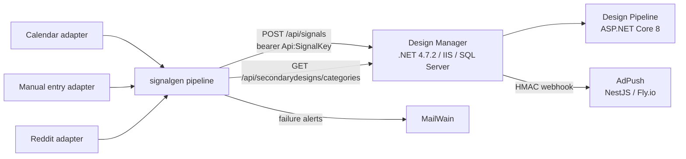

# Signal Generator — Architecture Specification v1.0

**Status:** Draft for review (Kandus + Chris)
**Date:** 2026-09-20
**Service name:** `signalgen`

---

## 1. Overview

`signalgen` is a standalone service that observes external content sources, normalizes observations into signals, and posts them to Design Manager's `POST /api/signals` endpoint. It is fire-and-forget upstream of DM: all matching, review, commissioning, and advertising happens downstream in DM / Design Pipeline / AdPush.

### Goals (v1)
- Generate real, taxonomy-aligned signals from three sources: calendar/seasonal, manual entry, Reddit
- Never violate DM's rate contract (10/min, 500/day)
- Never post duplicate signals for the same underlying trend within a suppression window
- Zero-ops deployment on existing self-hosted Linux infrastructure
- Serve as the team-training vehicle for Chris (brief-driven workflow, adapter ownership)

### Non-goals (v1)
- Feedback/outcome consumption from DM (telemetry hooks only)
- Escalation refires (same trend, rising engagement → new signal)
- Google Trends, Etsy trends, competitor monitoring, LinkedIn, X, TikTok
- Multi-tenant anything; this is single-tenant Sartorial
- Any public web surface

---

## 2. System context



- **DM** consumes signals, runs three-tier matching (taxonomy → keyword → Claude ranking), routes to human review.
- **signalgen** is outbound-only. No public ingress. Manual entry surface is LAN/VPN-scoped.
- **MailWain** (our transactional email service) delivers operational alerts.
- Strategic note: AdPush already integrates Reddit Ads. Reddit-sourced signals can be advertised back into the communities they came from.

---

## 3. Platform decisions

| Concern | Decision | Rationale |
|---|---|---|
| Language/runtime | TypeScript, Node 22 LTS | Portfolio standard; Chris's learning transfers to AdPush/MerchIQ |
| Framework | NestJS | DI/module system maps directly onto the adapter pattern; matches AdPush |
| Scheduler | `@nestjs/schedule` in-process cron | Single instance, low throughput; no external scheduler needed |
| Database | Postgres on Supabase, via Prisma | CommVergent platform standard (matches AdPush et al.); managed backups; Prisma matches AdPush |
| DB location | Dedicated Supabase project `signalgen` (not shared with AdPush) | Per-service project isolation; blast radius and key rotation stay independent |
| DB connections | Prisma `DATABASE_URL` = Supavisor pooled string (`?pgbouncer=true`), `directUrl` = direct connection for migrations | Standard Supabase+Prisma gotcha; low connection count but pooler is free insurance |
| Deployment | Docker container on existing self-hosted Linux host, docker compose, restart `unless-stopped` | Outbound-only service — Fly.io's ingress/anycast value is zero here; runs free on owned infra |
| Config/secrets | `.env` on host (not in image), validated at boot with zod; fail-fast on invalid config | Standard; no secrets manager warranted at this scale |
| HTTP client | Native `fetch` + thin wrappers | No axios/snoowrap dependencies; Reddit client is ~100 lines |
| IDs | ULID for `signalId` | Sortable, collision-safe, generated locally before post |
| Logging | pino, structured JSON → container stdout → journald | Grep-able; no log infra needed |
| Alerting | MailWain transactional email | Eat our own dog food; already deployed |

**Deliberately rejected:** message queue (BullMQ/Redis) — 500 signals/day ceiling makes it overengineering; in-process pipeline with a DB-backed ledger gives the same durability. SQLite — zero-ops appeal loses to portfolio standardization on Supabase Postgres.

**Accepted tradeoff:** the service is self-hosted but its state is cloud-hosted, so Supabase unavailability stalls the pipeline. Acceptable because every adapter run is idempotent and self-healing (calendar lookahead, Reddit re-poll, ULIDs persisted pre-post) — a stalled run is skipped work, not lost work. DB errors fail the run, alert on 3 consecutive, and the next cron recovers.

---

## 4. High-level architecture

```mermaid
flowchart TD
    SCHED[Scheduler] -->|cron per adapter| AD[SourceAdapter.fetch]
    AD -->|CandidateSignal[]| VAL[Schema validation - zod]
    VAL --> TAX[Taxonomy alignment check]
    TAX --> FP[Fingerprint + dedup]
    FP -->|new| LED[Ledger: create row, status=pending]
    FP -->|suppressed| SUP[Ledger: status=suppressed]
    LED --> BUD[Rate budget check]
    BUD --> POST[DM client: POST /api/signals]
    POST -->|2xx| OK[status=posted]
    POST -->|4xx| PERM[status=failed_permanent + alert]
    POST -->|429/5xx/network| RETRY[backoff retry schedule]
    RETRY -->|exhausted| PARK[status=failed + alert]
```

### Module layout

```
src/
  config/            # zod-validated config, env loading
  dm/                # DM client: auth, rate limiter, taxonomy cache, POST w/ retries
  pipeline/          # validation, taxonomy alignment, fingerprint, dedup, budget, dispatch
  adapters/
    calendar/
    manual/
    reddit/
  persistence/       # Prisma schema, repositories
  notify/            # MailWain alert client
  health/            # GET /healthz (LAN only)
```

Adding a source = new directory under `adapters/`, one module registration. Nothing else changes.

---

## 5. Adapter framework

```typescript
interface SourceAdapter {
  /** Stable sourceKey sent to DM, e.g. "calendar", "manual", "reddit" */
  readonly key: string;
  /** Cron expression; null for push-style adapters (manual) */
  readonly schedule: string | null;
  /** Fetch and normalize. Adapter owns auth, query semantics, mapping. */
  fetch(ctx: RunContext): Promise<CandidateSignal[]>;
}
```

**Contract rules:**
- Adapters emit `CandidateSignal` — the normalized internal shape mirroring DM's contract (required: `sourceKey`, `topic`, `tone`, `platform`, `capturedAt`; recommended fields as available; source-specific detail in `extensions`).
- Adapters do **not** post, dedup, or rate-limit. Pipeline owns everything after `fetch()` returns.
- Adapter failures are isolated: a throwing adapter logs, records a failed `adapter_run`, and never blocks other adapters.
- Every run is recorded in `adapter_runs` regardless of outcome.

### Taxonomy alignment policy

DM exposes `GET /api/secondarydesigns/categories` (valid Category/Subcategory/Tone). Pipeline caches this with a 6-hour TTL and a persisted snapshot (survives DM downtime at boot).

Adapters SHOULD map to valid taxonomy values when confident (calendar events are pre-mapped; Reddit uses a curated keyword→taxonomy map). When not confident, emit the raw topic + `keywords[]` and set `extensions.taxonomyAligned = false` — DM's tier-2 keyword and tier-3 Claude matching exist precisely for this. Pipeline validation is therefore:
- **Schema-invalid** → rejected, never posted, logged
- **Taxonomy-aligned** → posted with `extensions.taxonomyAligned = true`
- **Not aligned but schema-valid** → posted, flagged false

---

## 6. DM client

- **Auth:** `Api:SignalKey` bearer from env.
- **Rate limiting:** token bucket at 10/min plus a persistent daily counter (500/day). Both enforced client-side *before* dispatch; 429s from DM are treated as a bug in our accounting and alerted.
- **Daily budget allocation:** per-adapter caps from config so one noisy source can't starve others. Initial: reddit ≤ 100/day, calendar ≤ 50/day, manual ≤ 50/day, remainder reserved headroom. ⚠ **Open question OQ-3:** confirm whether DM's daily window is rolling 24h or calendar-day, and in which timezone — the counter reset must match.
- **Idempotency:** `signalId` (ULID) is generated and persisted to the ledger *before* the first POST attempt. Retries reuse it; DM's idempotency makes retries safe.
- **Retry schedule** on 5xx/network: 1m → 5m → 30m → 2h → 6h, then park as `failed` + MailWain alert. 4xx (except 429) is `failed_permanent` immediately + alert — it means our payload or contract understanding is wrong.
- **Dry-run mode:** `DRY_RUN=true` runs the full pipeline including ledger writes but skips the POST, recording `status=dry_run`. This is the safety valve for a no-staging environment and the default mode for every new adapter's first deploy.

---

## 7. Data model (Prisma / Supabase Postgres)

```prisma
model Signal {
  id            String   @id            // ULID = signalId sent to DM
  fingerprint   String
  sourceKey     String
  topic         String
  subtopic      String?
  tone          String
  platform      String
  payload       Json                    // full body as posted
  status        String                  // pending|posted|suppressed|dry_run|failed|failed_permanent|rejected_schema
  attempts      Int      @default(0)
  dmStatusCode  Int?
  dmResponse    String?
  createdAt     DateTime @default(now())
  postedAt      DateTime?
  @@index([fingerprint])
  @@index([sourceKey, createdAt])
}

model Fingerprint {
  hash               String   @id       // sha256 of normalized (sourceKey|topic|subtopic)
  sourceKey          String
  firstSeenAt        DateTime
  lastSeenAt         DateTime
  lastPostedSignalId String?
  suppressUntil      DateTime?
}

model AdapterRun {
  id                Int      @id @default(autoincrement())
  adapterKey        String
  startedAt         DateTime
  finishedAt        DateTime?
  status            String             // ok|failed
  itemsFetched      Int      @default(0)
  candidatesEmitted Int      @default(0)
  error             String?
  @@index([adapterKey, startedAt])
}

model DailyBudget {
  day        String  @id               // YYYY-MM-DD in DM's rate window TZ (OQ-3)
  totalUsed  Int     @default(0)
  byAdapter  Json                      // map adapterKey -> count
}

model TaxonomySnapshot {
  id        Int      @id @default(autoincrement())
  fetchedAt DateTime
  body      Json                      // raw response from DM
}
```

The `Signal` table is the **telemetry hook**: every posted signalId lives here, so a future DM outcome endpoint joins on it with zero redesign. Signals and runs are retained indefinitely for now — dataset stays small; add a pruning policy if it ever matters.

---

## 8. Dedup & decay policy

- **Fingerprint:** `sha256(sourceKey | lowercase(trim(topic)) | lowercase(trim(subtopic ?? "")))`
- **Suppression windows (per source class, config-driven):**
  - calendar: fingerprint includes the event year → natural annual recurrence, no explicit window
  - reddit: 21 days from post
  - manual: 7 days (humans repeating themselves quickly is usually intentional; short window)
- Suppressed candidates are recorded (`status=suppressed`) so we can see what dedup is eating.
- **Decay hints (`signalDecayHint`):**
  - calendar: the event date itself
  - reddit: `capturedAt + 10 days`
  - manual: operator-supplied, default `capturedAt + 14 days`
- Escalation refires are explicitly out of v1. If added later: new signalId, prior signalId referenced in `extensions.escalationOf`.

---

## 9. v1 adapters

### 9.1 Calendar (`sourceKey: "calendar"`, cron: daily 06:00)
- Static event registry as a versioned TS data file: `{ name, month/day or nth-weekday rule, leadDays, taxonomy mapping (category/subcategory/tone), keywords, audience }`.
- Initial registry targets occupation-pride and hobbyist events: Nurses Week, Skilled Trades Day, Father's/Mother's Day, Teacher Appreciation, EMS Week, Linemen Appreciation Day, National Welding Month, Woodworking-adjacent observances, etc. (Registry content is its own review task — Chris drafts it.)
- Daily run scans a 90-day lookahead; emits a candidate when `today >= eventDate - leadDays`. Lookahead + fingerprint-with-year means missed runs (host down) self-heal on next run.
- `leadDays` defaults: 45 (allows commission path through Design Pipeline), overridable per event.
- Zero auth, zero external calls. **This is the Chris-led adapter (Phase 2).**

### 9.2 Manual (`sourceKey: "manual"`, push-style, no cron)
- Two surfaces, same code path:
  - CLI: `signalgen manual:submit --topic ... --tone ...` (nest-commander) on the host
  - `POST /manual/signals` — LAN/VPN-bound HTTP endpoint, static bearer token, zod-validated
- ⚠ **Open question OQ-2:** does Chris need remote submission? If yes, endpoint goes behind the existing reverse proxy with auth; if no, LAN-only binding stands.

### 9.3 Reddit (`sourceKey: "reddit"`, cron: daily 07:00)
- OAuth2 client-credentials script app; thin custom client (token refresh + fetch), well under Reddit's 100 QPM.
- Config-driven **watchlist**: `{ subreddit, keywordSet[], taxonomyMapping, minScore, minComments }`. Watchlist lives in a config file for v1 (reviewable in git); DB-backed only if a management UI ever exists.
- Per run: pull `top?t=day` + `hot` (first pages) per watchlist subreddit; candidate when a post matches a keywordSet and clears score/comment thresholds. `platform: "reddit"`, `subplatform: subreddit`, `sourceUrl`, `sourceAuthor`, `sourceExcerpt` (truncated ≤ 500 chars), `engagementMetrics: { score, comments, upvoteRatio }`.
- Rolling engagement baselines per subreddit (percentile thresholds) are v2; v1 thresholds are hand-tuned per subreddit in the watchlist.
- Data handling: store only what we post (excerpt-length capped); no bulk archival of Reddit content — keeps us inside Reddit API terms.
- ⚠ **Open question OQ-4:** initial subreddit watchlist — draft against Sartorial's actual best-selling occupation segments.

---

## 10. Observability & operations

- **Logs:** pino JSON, one line per pipeline decision (candidate id, stage, outcome).
- **Health:** `GET /healthz` (LAN) — DB reachable, last successful run per adapter, taxonomy snapshot age, today's budget usage.
- **MailWain alerts:**
  - any `failed_permanent` (contract drift — highest severity)
  - adapter with 3 consecutive failed runs
  - retry exhaustion (`failed`)
  - unexpected 429 from DM
  - optional daily digest: candidates / posted / suppressed / rejected per adapter (decide in Phase 1)
- **Backups:** Supabase automated daily backups (plan-dependent retention); nothing stateful on the host — container is fully disposable.
- **Runbook basics** (to be written in Phase 0 README): rotate SignalKey, force taxonomy refresh, replay a failed signal, toggle dry-run, disable one adapter.

---

## 11. Security & data handling

- Outbound-only; the only listeners are `/healthz` and `/manual/signals`, both LAN/VPN-bound. No public ingress, no TLS termination needed on-box (LAN) unless OQ-2 changes this.
- Secrets in host `.env`: `DATABASE_URL`, `DIRECT_URL`, `DM_SIGNAL_KEY`, `REDDIT_CLIENT_ID/SECRET`, `MANUAL_API_TOKEN`, `MAILWAIN_*`. Never in image or repo. Supabase service keys are not needed — Prisma over the Postgres connection only; RLS off (no client-side access exists).
- Stored third-party content is limited to what DM receives (excerpt-capped). Public content only; no PII beyond public usernames in `sourceAuthor`.

---

## 12. Testing strategy

- **Unit:** adapter normalization + taxonomy mapping (calendar date rules get table-driven tests — nth-weekday logic is where bugs live); fingerprint canonicalization; budget accounting.
- **Contract:** a zod schema mirroring DM's `POST /api/signals` contract is the single source of truth; every candidate validates against it in tests and at runtime. ⚠ **OQ-1:** paste the field-by-field contract from the previous thread so this schema is exact, not reconstructed.
- **Integration:** no DM sandbox exists → dry-run mode is the integration harness. Each adapter ships with a `--dry-run` rehearsal producing a reviewable ledger before its first real post.
- **No staging:** first real post of each adapter is a supervised single-signal run (budget cap temporarily set to 1).

---

## 13. Phasing

| Phase | Scope | Stop condition | Lead |
|---|---|---|---|
| **0** | Scaffold, config+zod, Prisma+SQLite, DM client (auth, limiter, taxonomy cache, POST w/ retries), ledger, dry-run mode, healthz, MailWain notifier | Hand-built candidate passes schema + taxonomy validation in dry-run; one supervised real signal lands in DM's review queue | Kandus writes brief; Chris reviews brief + code walk |
| **1** | Pipeline core: fingerprint/dedup, suppression windows, budget allocator + manual adapter (CLI + endpoint) | Manual signal posts; identical resubmission within window is suppressed and visible in ledger | Kandus writes brief; Chris reviews |
| **2** | Calendar adapter + event registry | 90-day lookahead dry-run emits correct signal set (hand-verified against registry); one supervised real post | **Chris writes brief, drives Claude Code; Kandus reviews** |
| **3** | Reddit adapter + watchlist | Dry-run over live watchlist stays within caps, candidates correctly mapped or flagged unaligned; supervised real post | Pair: Chris drafts, Kandus co-reviews |

Each phase gets its own implementation brief with explicit scope and stop conditions per standard workflow. Nothing beyond Phase 3 is committed.

### Team-training map
- Phase 0–1: Chris learns to *read* briefs and review diffs (brief anatomy, stop conditions, why dry-run exists)
- Phase 2: Chris owns a vertical slice end-to-end — brief authorship → Claude Code execution → review → supervised deploy
- Phase 3: pairing on an adapter with real external-API concerns (auth, rate limits, ToS)

---

## 14. Open questions (resolve before Phase 0 brief)

| # | Question | Blocking |
|---|---|---|
| OQ-1 | Paste field-by-field `POST /api/signals` contract from previous thread → exact zod schema | Phase 0 |
| OQ-2 | Does Chris need remote manual-entry access (reverse proxy + auth) or is LAN/VPN sufficient? | Phase 1 |
| OQ-3 | DM rate-window semantics: rolling 24h vs calendar day, and timezone | Phase 0 |
| OQ-4 | Initial Reddit watchlist (subreddits + thresholds) from Sartorial's actual segment performance | Phase 3 |
| OQ-5 | Which host on the Linux infra runs the container; confirm outbound egress to Supabase + Reddit + DM from that host | Phase 0 |
| OQ-6 | Alert recipients (you only, or Chris too) | Phase 0 |

---

## 15. Future (designed-for, not built)

- **Feedback loop:** DM exposes an outcome endpoint (commissioned/advertised/discarded per signalId); signalgen joins on its ledger, surfaces per-adapter hit rates, eventually tunes thresholds. Ledger already carries everything needed.
- **Escalation refires** per §8.
- **Google Trends adapter** once official API access stabilizes.
- **Watchlist management UI** if the config file becomes friction.
