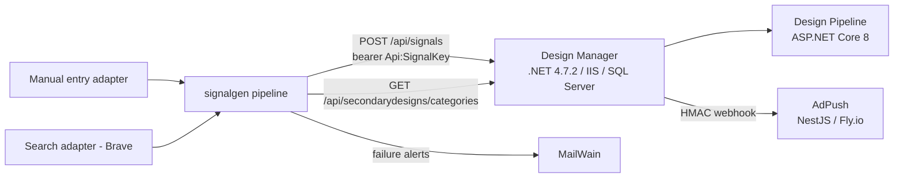

# Signal Generator — Architecture Specification v1.0

**Status:** Draft for review (Kandus + Chris)
**Date:** 2026-09-20
**Service name:** `signalgen`

---

## 1. Overview

`signalgen` is a standalone service that observes external content sources, normalizes observations into signals, and posts them to Design Manager's `POST /api/signals` endpoint. It is fire-and-forget upstream of DM: all matching, review, commissioning, and advertising happens downstream in DM / Design Pipeline / AdPush.

### Goals (v1)
- Generate real, taxonomy-aligned signals from two sources: manual entry, web search (Brave Search API)
- Never violate DM's rate contract (10/min, 500/day)
- Never post duplicate signals for the same underlying trend within a suppression window
- Serve as the team-training vehicle for Chris (brief-driven workflow, vertical-slice ownership)

### Non-goals (v1)
- Feedback/outcome consumption from DM (telemetry hooks only)
- Escalation refires (same trend, rising engagement → new signal)
- Google Trends, Etsy trends, competitor monitoring, LinkedIn, X, TikTok
- Multi-tenant anything; this is single-tenant Sartorial
- Any public web surface

---

## 2. System context



- **DM** consumes signals, runs three-tier matching (taxonomy → keyword → Claude ranking), routes to human review.
- **signalgen** runs on Fly.io. Public surface is minimal: `/manual/signals` (bearer token) and `/healthz`; everything else is outbound.
- **MailWain** (our transactional email service) delivers operational alerts.
- Strategic note: the search watchlist can target Reddit content (`site:reddit.com/r/…` queries — Brave's index retained Reddit access when other engines lost it in 2024; freshness to be observed in dry-run). AdPush already integrates Reddit Ads, so Reddit-observed signals can still be advertised back into the communities they came from. Direct Reddit Data API access is a future adapter pending commercial approval (§15).

---

## 3. Platform decisions

| Concern | Decision | Rationale |
|---|---|---|
| Language/runtime | TypeScript, Node 22 LTS | Portfolio standard; Chris's learning transfers to AdPush/MerchIQ |
| Framework | NestJS | DI/module system maps directly onto the adapter pattern; matches AdPush |
| Scheduler | `@nestjs/schedule` in-process cron | Single instance, low throughput; no external scheduler needed |
| Database | Postgres on Supabase, via Prisma | CommVergent platform standard (matches AdPush et al.); managed backups; Prisma matches AdPush |
| DB location | Dedicated Supabase project `signalgen` (not shared with AdPush) | Per-service project isolation; blast radius and key rotation stay independent |
| DB connections | Prisma `DATABASE_URL` = Supavisor pooled string (`?pgbouncer=true`), `directUrl` = direct connection for migrations | Standard Supabase+Prisma gotcha; low connection count but pooler is free insurance |
| Deployment (service) | Fly.io, single machine (`count=1`), Dockerfile deploy | Portfolio consistency with AdPush; puts manual-entry endpoint reachable for Chris without VPN plumbing |
| Deployment (web) | Next.js on Vercel (Phase 4: manual-entry UI + read-only ops views) | Portfolio standard pairing |
| Migrations | Prisma Migrate — `migrate dev` against local Docker Postgres, `migrate deploy` in Fly release command against Supabase | Supabase shadow-DB friction avoided; prod schema changes ride the deploy, reviewable as SQL |
| Cron safety | Exactly one Fly machine + `pg_advisory_lock` per adapter run | Guards against double-fire if machine count ever drifts |
| Config/secrets | `.env` on host (not in image), validated at boot with zod; fail-fast on invalid config | Standard; no secrets manager warranted at this scale |
| HTTP client | Native `fetch` + thin wrappers | No axios/snoowrap dependencies; Reddit client is ~100 lines |
| IDs | ULID for `signalId` | Sortable, collision-safe, generated locally before post |
| Logging | pino, structured JSON → container stdout → journald | Grep-able; no log infra needed |
| Alerting | MailWain transactional email | Eat our own dog food; already deployed |

**Deliberately rejected:** message queue (BullMQ/Redis) — 500 signals/day ceiling makes it overengineering; in-process pipeline with a DB-backed ledger gives the same durability. SQLite — portfolio standardization on Supabase Postgres. Self-hosted Docker — superseded by Fly.io for portfolio consistency and public reachability of the manual/ops surfaces.

**Resilience note:** every adapter run is idempotent and self-healing (Reddit re-poll, ULIDs persisted pre-post) — a stalled run from Supabase/Fly disruption is skipped work, not lost work. DB errors fail the run, alert on 3 consecutive, and the next cron recovers.

---

## 4. High-level architecture

```mermaid
flowchart TD
    SCHED[Scheduler] -->|cron per adapter| AD[SourceAdapter.fetch]
    AD -->|CandidateSignal[]| VAL[Schema validation - zod]
    VAL --> TAX[Taxonomy alignment check]
    TAX --> FP[Fingerprint + dedup]
    FP -->|new| LED[Ledger: create row, status=pending]
    FP -->|suppressed| SUP[Ledger: status=suppressed]
    LED --> BUD[Rate budget check]
    BUD --> POST[DM client: POST /api/signals]
    POST -->|2xx| OK[status=posted]
    POST -->|4xx| PERM[status=failed_permanent + alert]
    POST -->|429/5xx/network| RETRY[backoff retry schedule]
    RETRY -->|exhausted| PARK[status=failed + alert]
```

### Module layout

```
src/
  config/            # zod-validated config, env loading
  dm/                # DM client: auth, rate limiter, taxonomy cache, POST w/ retries
  pipeline/          # validation, taxonomy alignment, fingerprint, dedup, budget, dispatch
  adapters/
    manual/
    search/
  persistence/       # Prisma schema, repositories
  notify/            # MailWain alert client
  health/            # GET /healthz (LAN only)
```

Adding a source = new directory under `adapters/`, one module registration. Nothing else changes.

---

## 5. Adapter framework

```typescript
interface SourceAdapter {
  /** Internal adapter key ("manual", "search") — used for ledger, fingerprints,
   *  budget caps. NOT the wire sourceKey: DM's sourceKey identifies the
   *  generator instance and is the fixed constant "signalgen-v1" for all
   *  signals; the observation source travels in platform/subplatform. */
  readonly key: string;
  /** Cron expression; null for push-style adapters (manual) */
  readonly schedule: string | null;
  /** Fetch and normalize. Adapter owns auth, query semantics, mapping. */
  fetch(ctx: RunContext): Promise<CandidateSignal[]>;
}
```

**signalId convention:** `{shortcode}_{ULID}` (`man_…`, `srch_…`) — per DM's prefix recommendation, ≤64 chars, generated and persisted before first POST.

**Contract rules:**
- Adapters emit `CandidateSignal` — the normalized internal shape mirroring DM's contract (required: `sourceKey`, `topic`, `tone`, `platform`, `capturedAt`; recommended fields as available; source-specific detail in `extensions`).
- Adapters do **not** post, dedup, or rate-limit. Pipeline owns everything after `fetch()` returns.
- Adapter failures are isolated: a throwing adapter logs, records a failed `adapter_run`, and never blocks other adapters.
- Every run is recorded in `adapter_runs` regardless of outcome.

### Taxonomy alignment policy

DM exposes `GET /api/secondarydesigns/categories` (valid Category/Subcategory/Tone). Pipeline caches this with a 6-hour TTL and a persisted snapshot (survives DM downtime at boot).

Ground truth (post-integration): DM validates almost nothing — unknown Category/Subcategory values pass through (Tier 2/3 still match, Tier 1 doesn't fire), and tone is publish-only: DM accepts any tone string and never 400s, but Tier 1 matching does an exact string compare of signal tone vs design tone, so only tones from DM's published list (`tones` in the categories response, config-sourced, omitted when unconfigured) produce tone matches. Policy therefore splits:
- **tone** — validated against the published list *before* post as match-quality discipline; invalid tone is a pipeline rejection (`rejected_tone`), never sent. When DM publishes no tones, the gate degrades to skip (recorded in logs/healthz).
- **topic/subtopic** — adapters SHOULD map to valid Category/Subcategory when confident (manual entry selects from the live taxonomy; search uses per-query taxonomy mappings); when not confident, emit raw topic + `keywords[]` and set `extensions.taxonomyAligned = false`

Pipeline validation outcomes:
- **Schema-invalid** → rejected, never posted, logged
- **Policy-blocked** → `rejected_policy`, never posted: a config-driven denylist (repo-reviewed; `{pattern, match: word|substring, scope: topic|keywords|excerpt|all, reason}`, case-folded, word-boundary default) screens every candidate between schema validation and the tone gate. Matched rule recorded in the ledger row's `dmResponse` Json; no fingerprint write (denylist edits must take effect immediately); no alert — the ledger is the audit. Rationale: DM barely validates and its human reviewer is the only downstream guard, so the screen protects the 500/day budget, reviewer attention, and DM storage from disallowed topics (trademarks, tragedy/breaking-news terms, NSFW, competitor names). Ships with the search adapter (Phase 2); an AI moderation pass is future work, added only if the wordlist measurably leaks.
- **Taxonomy-aligned** → posted with `extensions.taxonomyAligned = true`
- **Not aligned but schema-valid** → posted, flagged false

---

## 6. DM client

- **Auth:** `Api:SignalKey` bearer from env. `Idempotency-Key` header = `signalId` on every POST (per docs).
- **Rate limiting:** token bucket at 10/min plus a **trailing-24h rolling count** from the ledger (`posted` in last 24h < 500, per-adapter caps likewise). Rolling accounting is strictly conservative under both possible DM window semantics (rolling or calendar-day), which closes OQ-3 without needing DM's internal answer. Both enforced client-side *before* dispatch.
- **Daily budget allocation:** per-adapter caps from config so one noisy source can't starve others. Initial: search ≤ 100, manual ≤ 50 per trailing 24h, remainder reserved headroom. Bursts buffer and drain within the per-minute budget (docs require self-throttling).
- **Response semantics** (per docs):
  - `202 ACCEPTED` → `posted`
  - `200 DUPLICATE` → `posted`, but logged as an anomaly counter — local dedup should have prevented the resend
  - `400 VALIDATION_FAILED` / `401` → `failed_permanent` + alert (contract drift or key rotation)
  - `429` → honor `Retry-After`, then retry; alert regardless — any 429 means our accounting is wrong
  - `5xx`/network → retry schedule below
- **Idempotency:** `signalId` is generated and persisted to the ledger *before* the first POST attempt. Retries reuse it; DM guarantees exactly-once processing on `signalId`, so at-least-once delivery from our side is correct by design.
- **Retry schedule** on 5xx/network: 1m → 5m → 30m → 2h → 6h, then park as `failed` + MailWain alert.
- **Dry-run mode:** `DRY_RUN=true` runs the full pipeline including ledger writes but skips the POST, recording `status=dry_run`. This is the safety valve for a no-staging environment and the default mode for every new adapter's first deploy.

---

## 7. Data model (Prisma / Supabase Postgres)

```prisma
model Signal {
  id            String   @id            // "{shortcode}_{ULID}" = signalId sent to DM
  fingerprint   String
  adapterKey    String                  // internal: manual|reddit (wire sourceKey is the fixed generator id)
  topic         String
  subtopic      String?
  tone          String
  platform      String
  payload       Json                    // full body as posted
  status        String                  // pending|posted|suppressed|dry_run|failed|failed_permanent|rejected_schema|rejected_tone|rejected_policy
  attempts      Int      @default(0)
  dmStatusCode  Int?
  dmResponse    Json?
  createdAt     DateTime @default(now())
  postedAt      DateTime?
  @@index([fingerprint])
  @@index([adapterKey, createdAt])
  @@index([status, postedAt])           // trailing-24h budget query
}

model Fingerprint {
  hash               String   @id       // sha256 of normalized (adapterKey|topic|subtopic)
  adapterKey         String
  firstSeenAt        DateTime
  lastSeenAt         DateTime
  lastPostedSignalId String?
  suppressUntil      DateTime?
}

model AdapterRun {
  id                Int      @id @default(autoincrement())
  adapterKey        String
  startedAt         DateTime
  finishedAt        DateTime?
  status            String             // ok|failed
  itemsFetched      Int      @default(0)
  candidatesEmitted Int      @default(0)
  error             String?
  @@index([adapterKey, startedAt])
}

model TaxonomySnapshot {
  id        Int      @id @default(autoincrement())
  fetchedAt DateTime
  body      Json                      // raw response from DM
}
```

No budget table: rolling-24h enforcement is an indexed count over `Signal` (`status=posted, postedAt > now()-24h`, grouped by adapterKey) — one source of truth, no counter drift.

The `Signal` table is the **telemetry hook**: every posted signalId lives here, so a future DM outcome endpoint joins on it with zero redesign. Signals and runs are retained indefinitely for now — dataset stays small; add a pruning policy if it ever matters.

---

## 8. Dedup & decay policy

- **Fingerprint:** `sha256(adapterKey | material)` where the material is **adapter-defined**:
  - manual: `lowercase(trim(topic)) | lowercase(trim(subtopic ?? ""))`
  - search: canonicalized result URL (scheme/host lowercased, tracking params stripped) — each distinct piece of content emits at most once
- **Suppression windows (per source class, config-driven):**
  - search: 21 days per URL fingerprint; plus a per-query emission cap (`maxCandidatesPerRun`, default 3) so one hot query can't flood a run
  - manual: 7 days (humans repeating themselves quickly is usually intentional; short window)
- Suppressed candidates are recorded (`status=suppressed`) so we can see what dedup is eating.
- **Decay hints (`signalDecayHint`):** DM's contract is the enum `IMMEDIATE | SHORT | EVERGREEN`, not a date.
  - search: `SHORT`
  - manual: operator-selected, default `SHORT`
- Escalation refires are explicitly out of v1. If added later: new signalId, prior signalId referenced in `extensions.escalationOf`.

---

## 9. v1 adapters

### 9.1 Manual (`sourceKey: "manual"`, push-style, no cron)
- Two surfaces, same code path:
  - `POST /manual/signals` — public Fly endpoint, static bearer token (`MANUAL_API_TOKEN`), zod-validated, rate-limited (Nest throttler)
  - Phase 3 web UI (Vercel) calls the same endpoint server-side; token never reaches the browser
- Until the UI exists, submission is curl/httpie from anywhere with the token — resolves former OQ-2 (Chris remote access) without VPN.

### 9.2 Search (`sourceKey` internal: "search", cron: daily 07:00)
- **Brave Search API**: single GET endpoint, `X-Subscription-Token` header, native fetch. $5/1k requests with $5 monthly credit; a ~30-query daily watchlist stays inside the credit. Commercial use permitted; **attribution required** — "Search powered by Brave" lands in the Phase 3 web app footer.
- Config-driven **watchlist**: `{ queryKey, query, freshness: "pd"|"pw", maxCandidatesPerRun, taxonomyMapping, keywords[], audience }`. Queries may be open-web or Reddit-scoped (`site:reddit.com/r/Welding <terms>`). Reddit coverage via Brave is expected (2024 exception) but unverified for freshness — **the dry-run ledger is the test**: first live watchlist runs in DRY_RUN show exactly how many Reddit-scoped queries return week-fresh results; thin results are a watchlist config change, not a code change.
- Per result → candidate: topic/subtopic/tone from the query's `taxonomyMapping`; `sourceExcerpt` = result snippet (≤500 chars); `sourceUrl` = result URL; **platform derivation from URL**: `reddit.com/r/X/...` → `platform: "Reddit"`, `subplatform: "r/X"`; otherwise `platform: "Web"`, `subplatform: <domain>`. `signalDecayHint: "SHORT"`, signalId `srch_{ULID}`, `extensions: { queryKey, rank, freshness }`.
- **No engagement metrics** — search results carry none; `engagementMetrics` omitted (contract-optional). Candidate selection is presence + freshness + rank, throttled by `maxCandidatesPerRun`.
- Data handling: store only what we post (snippet-capped); no bulk archival of result sets.
- Rolling engagement baselines per subreddit (percentile thresholds) are v2; v1 thresholds are hand-tuned per subreddit in the watchlist.
- Data handling: store only what we post (excerpt-length capped); no bulk archival of Reddit content — keeps us inside Reddit API terms.
- ⚠ **Open question OQ-4:** initial subreddit watchlist — draft against Sartorial's actual best-selling occupation segments.

---

## 10. Observability & operations

- **Logs:** pino JSON, one line per pipeline decision (candidate id, stage, outcome).
- **Health:** `GET /healthz` wired to Fly health checks — DB reachable, last successful run per adapter, taxonomy snapshot age, today's budget usage.
- **MailWain alerts:**
  - any `failed_permanent` (contract drift — highest severity)
  - adapter with 3 consecutive failed runs
  - retry exhaustion (`failed`)
  - unexpected 429 from DM
  - optional daily digest: candidates / posted / suppressed / rejected per adapter (decide in Phase 1)
- **Backups:** Supabase automated daily backups (plan-dependent retention); nothing stateful on the host — container is fully disposable.
- **Runbook basics** (to be written in Phase 0 README): rotate SignalKey, force taxonomy refresh, replay a failed signal, toggle dry-run, disable one adapter.

---

## 11. Security & data handling

- Public listeners limited to `/manual/signals` (bearer + throttled) and `/healthz`; TLS terminated by Fly. Everything else outbound.
- Secrets via `fly secrets` (service) and Vercel env (web): `DATABASE_URL`, `DIRECT_URL`, `DM_SIGNAL_KEY`, `BRAVE_API_KEY`, `MANUAL_API_TOKEN`, `MAILWAIN_*`. Never in image or repo. Supabase service keys not needed — Prisma over the Postgres connection only; RLS off (no client-side DB access exists).
- Stored third-party content is limited to what DM receives (excerpt-capped). Public content only; no PII beyond public usernames in `sourceAuthor`.

---

## 12. Testing strategy

- **Unit:** adapter normalization + taxonomy mapping; fingerprint canonicalization; budget accounting.
- **Contract:** a zod schema mirroring DM's `POST /api/signals` contract is the single source of truth; every candidate validates against it in tests and at runtime. DM's endpoints are built, tested, and documented — the schema derives verbatim from that documentation (committed as `docs/dm-contract.md`), not reconstructed.
- **Integration:** no DM sandbox exists → dry-run mode is the integration harness. Each adapter ships with a `--dry-run` rehearsal producing a reviewable ledger before its first real post.
- **No staging:** first real post of each adapter is a supervised single-signal run (budget cap temporarily set to 1).

---

## 13. Phasing

| Phase | Scope | Stop condition | Lead |
|---|---|---|---|
| **0** | Scaffold, config+zod, Prisma+Supabase, DM client (auth, limiter, taxonomy cache, POST w/ retries), ledger, dry-run mode, healthz, MailWain notifier | Hand-built candidate passes schema + taxonomy validation in dry-run; one supervised real signal lands in DM's review queue | Kandus writes brief; Chris reviews brief + code walk |
| **1** | Pipeline core: fingerprint/dedup, suppression windows, budget allocator + manual adapter (endpoint) | Manual signal posts; identical resubmission within window is suppressed and visible in ledger | Kandus writes brief; Chris reviews |
| **2** | Search adapter (Brave) + query watchlist | DRY_RUN over live watchlist stays within caps, mappings verified, Reddit-scoped query freshness measured from the ledger; supervised real post | Pair: Chris drafts, Kandus co-reviews |
| **3** | Vercel web app: manual-entry form + read-only ops views (ledger, runs, budget) | Chris submits a manual signal through the UI; ledger/run views reflect live data | **Chris writes brief, drives Claude Code; Kandus reviews** |

Each phase gets its own implementation brief with explicit scope and stop conditions per standard workflow. Nothing beyond Phase 3 is committed.

### Team-training map
- Phase 0–1: Chris learns to *read* briefs and review diffs (brief anatomy, stop conditions, why dry-run exists)
- Phase 2: pairing on an adapter with real external-API concerns (auth, cost accounting, watchlist curation)
- Phase 3: Chris owns a vertical slice end-to-end — brief authorship → Claude Code execution → review → supervised deploy

---

## 14. Open questions (resolve before Phase 0 brief)

| # | Question | Blocking |
|---|---|---|
| OQ-1 | ~~Endpoint contract~~ **Resolved:** documentation received; commit as `docs/dm-contract.md` | — |
| OQ-2 | ~~Chris remote access~~ **Resolved:** public Fly endpoint + bearer token; UI in Phase 3 | — |
| OQ-3 | ~~Rate-window semantics~~ **Resolved:** client enforces trailing-24h rolling counts — conservative under either DM interpretation | — |
| OQ-4 | Initial search query watchlist (open-web + Reddit-scoped queries, taxonomy mappings) from Sartorial's actual segment performance | Phase 2 |
| OQ-5 | Provisioning: Supabase project, Fly app + region + deploy token, GitHub repo, Brave API key (Phase 2), Vercel project (Phase 3) | Phase 0 |
| OQ-6 | Alert recipients (you only, or Chris too) | Phase 0 |

---

## 15. Future (designed-for, not built)

- **Reddit Data API adapter:** pending Reddit's commercial-access approval (application in flight — free tier is non-commercial only). On approval: OAuth2 client-credentials, subreddit polling with real engagement metrics, `rdt_` shortcode, public subreddits only per DM's do-not-send list. Slots into the adapter framework with zero pipeline changes; until then, Reddit-scoped search queries cover the gap.
- **Feedback loop:** DM exposes an outcome endpoint (commissioned/advertised/discarded per signalId); signalgen joins on its ledger, surfaces per-adapter hit rates, eventually tunes thresholds. Ledger already carries everything needed.
- **Escalation refires** per §8.
- **Google Trends adapter** once official API access stabilizes.
- **Watchlist management UI** if the config file becomes friction.
